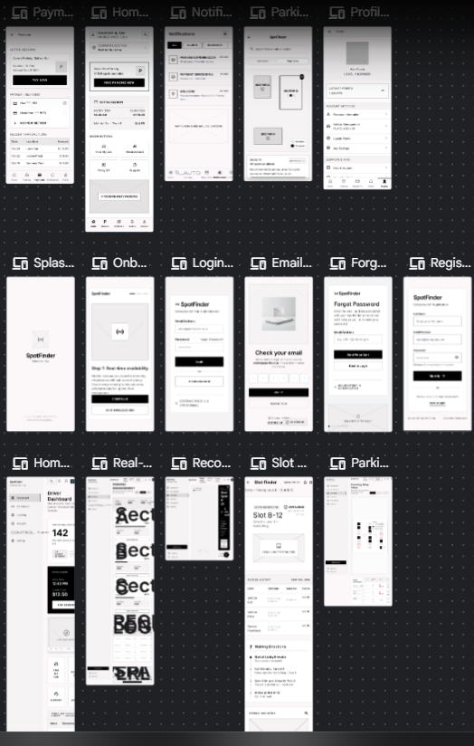
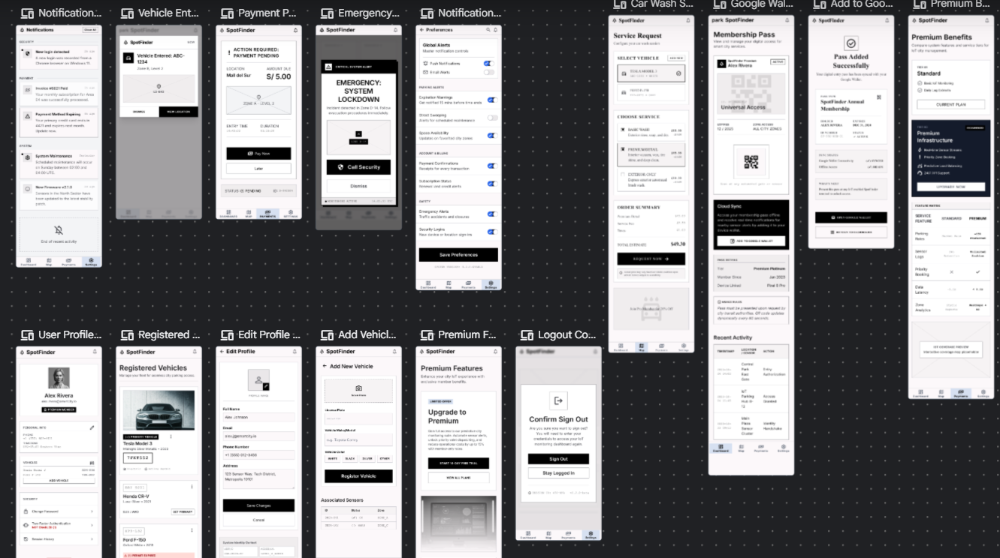
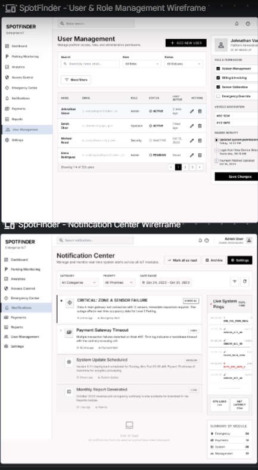
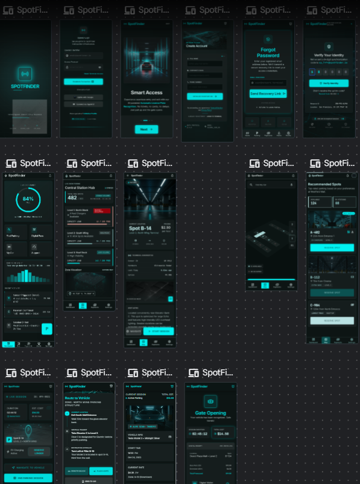

# COURSE PROJECT

<p align="center">
    </img><br>
    <strong>Universidad Peruana de Ciencias Aplicadas</strong><br>
    <br>
    <strong>Facultad de Ingeniería</strong><br>
    <strong>Carrera de Ingeniería de Software</strong><br>
    <strong>Ciclo 2026-10</strong>
</p>

<p align="center">
  <strong>Código del curso: </strong>1ASI0572<br>
  <strong>Curso: </strong>Desarrollo de Soluciones IOT
</p>

<p align="center">
  <strong>NRC: 6772</strong>
</p>

<p align="center">
    <strong>Profesor: </strong>Marco Antonio Leon Baca
</p>

<p align="center">
    <strong>Informe de Trabajo Final</strong>
</p>

<p align="center">
    <strong>Nombre del startup: </strong> [Startup]
</p>

<p align="center">
    <strong>Nombre del producto:</strong> [Producto]
</p>

<p align="center">
    <strong>Marzo, 2026</strong>
</p>

---

# Project Report Collaboration Insights
**URL del repositorio para el Project Report:** [https://github.com/IoTMedicineProject/report.git](https://github.com/IoTMedicineProject/report.git)

---

---

<div style="page-break-after: always;">

# Contenido

- [COURSE PROJECT](#course-project)
- [Project Report Collaboration Insights](#project-report-collaboration-insights)
- [Contenido](#contenido)
- [Student Outcome](#student-outcome)
- [Capítulo I: Introducción](#capítulo-i-introducción)
  - [1.1. Startup Profile](#11-startup-profile)
    - [1.1.1. Descripción de la Startup](#111-descripción-de-la-startup)
    - [1.1.2. Perfiles de integrantes del equipo](#112-perfiles-de-integrantes-del-equipo)
  - [1.2. Solution Profile](#12-solution-profile)
    - [1.2.1 Antecedentes y problemática](#121-antecedentes-y-problemática)
    - [1.2.2 Lean UX Process.](#122-lean-ux-process)
      - [1.2.2.1. Lean UX Problem Statements.](#1221-lean-ux-problem-statements)
      - [1.2.2.2. Lean UX Assumptions.](#1222-lean-ux-assumptions)
      - [1.2.2.3. Lean UX Hypothesis Statements.](#1223-lean-ux-hypothesis-statements)
      - [1.2.2.4. Lean UX Canvas.](#1224-lean-ux-canvas)
  - [1.3. Segmentos objetivo.](#13-segmentos-objetivo)
- [Capítulo II: Requirements Elicitation \& Analysis](#capítulo-ii-requirements-elicitation--analysis)
  - [2.1. Competidores.](#21-competidores)
    - [2.1.1. Análisis competitivo.](#211-análisis-competitivo)
    - [2.1.2. Estrategias y tácticas frente a competidores.](#212-estrategias-y-tácticas-frente-a-competidores)
  - [2.2. Entrevistas.](#22-entrevistas)
    - [2.2.1. Diseño de entrevistas.](#221-diseño-de-entrevistas)
    - [2.2.2. Registro de entrevistas.](#222-registro-de-entrevistas)
    - [2.2.3. Análisis de entrevistas.](#223-análisis-de-entrevistas)
  - [2.3. Needfinding.](#23-needfinding)
    - [2.3.1. User Personas.](#231-user-personas)
    - [2.3.2. User Task Matrix.](#232-user-task-matrix)
    - [2.3.3. User Journey Mapping.](#233-user-journey-mapping)
    - [2.3.4. Empathy Mapping.](#234-empathy-mapping)
  - [2.4. Big Picture Event Storming.](#24-big-picture-event-storming)
  - [2.5. Ubiquitous Language.](#25-ubiquitous-language)
- [Capítulo III: Requirements Specification](#capítulo-iii-requirements-specification)
  - [3.1. User Stories.](#31-user-stories)
  - [3.2. Impact Mapping.](#32-impact-mapping)
  - [3.3. Product Backlog.](#33-product-backlog)
- [Capítulo IV: Solution Software Design](#capítulo-iv-solution-software-design)
  - [4.1. Strategic-Level Domain-Driven Design.](#41-strategic-level-domain-driven-design)
    - [4.1.1. Design-Level EventStorming.](#411-design-level-eventstorming)
      - [4.1.1.1 Candidate Context Discovery.](#4111-candidate-context-discovery)
    - [Preparación de la sesión](#preparación-de-la-sesión)
    - [Candidate Contexts identificados para SpotFinder](#candidate-contexts-identificados-para-spotfinder)
    - [Clasificación estratégica en la matriz](#clasificación-estratégica-en-la-matriz)
    - [Resultados](#resultados)
      - [4.1.1.2 Domain Message Flows Modeling.](#4112-domain-message-flows-modeling)
      - [4.1.1.3 Bounded Context Canvases.](#4113-bounded-context-canvases)
    - [4.1.2. Context Mapping.](#412-context-mapping)
    - [4.1.3. Software Architecture.](#413-software-architecture)
      - [4.1.3.1. Software Architecture System Landscape Diagram.](#4131-software-architecture-system-landscape-diagram)
      - [4.1.3.2. Software Architecture Context Level Diagrams.](#4132-software-architecture-context-level-diagrams)
      - [4.1.3.3. Software Architecture Container Level Diagrams.](#4133-software-architecture-container-level-diagrams)
      - [4.1.3.4. Software Architecture Deployment Diagrams.](#4134-software-architecture-deployment-diagrams)
- [4.2. Tactical-Level Domain-Driven Design](#42-tactical-level-domain-driven-design)
  - [4.2.1. Bounded Context: Parking Monitoring](#421-bounded-context-parking-monitoring)
    - [4.2.1.1. Domain Layer](#4211-domain-layer)
      - [1. ParkingSlot (Aggregate Root)](#1-parkingslot-aggregate-root)
      - [2. ParkingFacility (Aggregate Root)](#2-parkingfacility-aggregate-root)
      - [3. RegisterParkingSlotCommand (Command)](#3-registerparkingslotcommand-command)
      - [4. UpdateSlotStatusCommand (Command)](#4-updateslotstatuscommand-command)
      - [5. ProcessSensorReadingCommand (Command)](#5-processsensorreadingcommand-command)
      - [6. Queries](#6-queries)
      - [7. SlotStatusChangedEvent (Domain Event)](#7-slotstatuschangedevent-domain-event)
      - [8. ParkingSlotCommandService (Domain Service)](#8-parkingslotcommandservice-domain-service)
      - [9. ParkingSlotQueryService (Domain Service)](#9-parkingslotqueryservice-domain-service)
      - [10. OccupancyCalculationService (Domain Service)](#10-occupancycalculationservice-domain-service)
      - [11. SlotCode (Value Object)](#11-slotcode-value-object)
      - [12. SlotStatus (Value Object)](#12-slotstatus-value-object)
      - [13. SensorId (Value Object)](#13-sensorid-value-object)
      - [14. FacilityId (Value Object)](#14-facilityid-value-object)
    - [4.2.1.2. Interface Layer](#4212-interface-layer)
      - [1. ParkingSlotsController (REST Controller)](#1-parkingslotscontroller-rest-controller)
      - [2. SensorReadingsController (REST Controller)](#2-sensorreadingscontroller-rest-controller)
      - [3. Resources (DTOs)](#3-resources-dtos)
      - [4. Transform (Assemblers)](#4-transform-assemblers)
    - [4.2.1.3. Application Layer](#4213-application-layer)
      - [1. ParkingSlotCommandServiceImpl (Command Service Implementation)](#1-parkingslotcommandserviceimpl-command-service-implementation)
      - [2. ParkingSlotQueryServiceImpl (Query Service Implementation)](#2-parkingslotqueryserviceimpl-query-service-implementation)
      - [3. SlotStatusChangedEventHandler (Domain Event Handler)](#3-slotstatuschangedeventhandler-domain-event-handler)
    - [4.2.1.4. Infrastructure Layer](#4214-infrastructure-layer)
      - [1. ParkingSlotRepository (Repository Interface)](#1-parkingslotrepository-repository-interface)
      - [2. SensorReadingRepository (Repository Interface)](#2-sensorreadingrepository-repository-interface)
      - [3. WebSocketBroadcaster (Infrastructure Service)](#3-websocketbroadcaster-infrastructure-service)
    - [4.2.1.5. Bounded Context Software Architecture Component Level Diagrams](#4215-bounded-context-software-architecture-component-level-diagrams)
    - [4.2.1.6. Bounded Context Software Architecture Code Level Diagrams](#4216-bounded-context-software-architecture-code-level-diagrams)
      - [4.2.1.6.1. Bounded Context Domain Layer Class Diagrams](#42161-bounded-context-domain-layer-class-diagrams)
      - [4.2.1.6.2. Bounded Context Database Design Diagram](#42162-bounded-context-database-design-diagram)
  - [4.2.2. Bounded Context: Access Control](#422-bounded-context-access-control)
    - [4.2.2.1. Domain Layer](#4221-domain-layer)
      - [1. VehicleSession (Aggregate Root)](#1-vehiclesession-aggregate-root)
      - [2. AccessBarrier (Aggregate Root)](#2-accessbarrier-aggregate-root)
      - [3. CreateVehicleSessionCommand (Command)](#3-createvehiclesessioncommand-command)
      - [4. EndVehicleSessionCommand (Command)](#4-endvehiclesessioncommand-command)
      - [5. RecognizePlateCommand (Command)](#5-recognizeplatecommand-command)
      - [6. RegisterEntryCommand (Command)](#6-registerentrycommand-command)
      - [7. RegisterExitCommand (Command)](#7-registerexitcommand-command)
      - [8. OpenAllBarriersCommand (Command)](#8-openallbarrierscommand-command)
      - [9. Queries](#9-queries)
      - [10. VehicleSessionStartedEvent (Domain Event)](#10-vehiclesessionstartedevent-domain-event)
      - [11. VehicleSessionEndedEvent (Domain Event)](#11-vehiclesessionendedevent-domain-event)
      - [12. BarrierOpenedEvent (Domain Event)](#12-barrieropenedevent-domain-event)
      - [13. AccessCommandService (Domain Service)](#13-accesscommandservice-domain-service)
      - [14. VehicleSessionCommandService (Domain Service)](#14-vehiclesessioncommandservice-domain-service)
      - [15. VehicleSessionQueryService (Domain Service)](#15-vehiclesessionqueryservice-domain-service)
      - [16. LicensePlate (Value Object)](#16-licenseplate-value-object)
      - [17. SessionStatus (Value Object)](#17-sessionstatus-value-object)
      - [18. PaymentStatus (Value Object)](#18-paymentstatus-value-object)
      - [19. BarrierPosition (Value Object)](#19-barrierposition-value-object)
      - [20. BarrierStatus (Value Object)](#20-barrierstatus-value-object)
      - [21. BarrierCode (Value Object)](#21-barriercode-value-object)
      - [22. SlotId (Value Object)](#22-slotid-value-object)
      - [23. PlateRecognitionService (Domain Service Interface)](#23-platerecognitionservice-domain-service-interface)
    - [4.2.2.2. Interface Layer](#4222-interface-layer)
      - [1. AccessController (REST Controller)](#1-accesscontroller-rest-controller)
      - [2. ParkingSessionsController (REST Controller)](#2-parkingsessionscontroller-rest-controller)
      - [3. Resources (DTOs)](#3-resources-dtos-1)
      - [4. Transform (Assemblers)](#4-transform-assemblers-1)
    - [4.2.2.3. Application Layer](#4223-application-layer)
      - [1. AccessCommandServiceImpl (Command Service Implementation)](#1-accesscommandserviceimpl-command-service-implementation)
      - [2. VehicleSessionCommandServiceImpl (Command Service Implementation)](#2-vehiclesessioncommandserviceimpl-command-service-implementation)
      - [3. VehicleSessionQueryServiceImpl (Query Service Implementation)](#3-vehiclesessionqueryserviceimpl-query-service-implementation)
      - [4. VehicleSessionStartedEventHandler (Domain Event Handler)](#4-vehiclesessionstartedeventhandler-domain-event-handler)
      - [5. VehicleSessionEndedEventHandler (Domain Event Handler)](#5-vehiclesessionendedeventhandler-domain-event-handler)
      - [6. ExternalIamService (Outbound ACL Service)](#6-externaliamservice-outbound-acl-service)
      - [7. ExternalNotificationService (Outbound ACL Service)](#7-externalnotificationservice-outbound-acl-service)
      - [8. ExternalParkingMonitoringService (Outbound ACL Service)](#8-externalparkingmonitoringservice-outbound-acl-service)
    - [4.2.2.4. Infrastructure Layer](#4224-infrastructure-layer)
      - [1. VehicleSessionRepository (Repository Interface)](#1-vehiclesessionrepository-repository-interface)
      - [2. AccessBarrierRepository (Repository Interface)](#2-accessbarrierrepository-repository-interface)
      - [3. PlateRecognizerClient (Infrastructure Service)](#3-platerecognizerclient-infrastructure-service)
    - [4.2.2.5. Bounded Context Software Architecture Component Level Diagrams](#4225-bounded-context-software-architecture-component-level-diagrams)
    - [4.2.2.6. Bounded Context Software Architecture Code Level Diagrams](#4226-bounded-context-software-architecture-code-level-diagrams)
      - [4.2.2.6.1. Bounded Context Domain Layer Class Diagrams](#42261-bounded-context-domain-layer-class-diagrams)
      - [4.2.2.6.2. Bounded Context Database Design Diagram](#42262-bounded-context-database-design-diagram)
  - [4.2.3. Bounded Context: Payment Processing](#423-bounded-context-payment-processing)
    - [4.2.3.1. Domain Layer](#4231-domain-layer)
      - [1. Payment (Aggregate Root)](#1-payment-aggregate-root)
      - [2. InitiatePaymentCommand (Command)](#2-initiatepaymentcommand-command)
      - [3. CalculateFeeCommand (Command)](#3-calculatefeecommand-command)
      - [4. Queries](#4-queries)
      - [5. PaymentSucceededEvent (Domain Event)](#5-paymentsucceededevent-domain-event)
      - [6. PaymentFailedEvent (Domain Event)](#6-paymentfailedevent-domain-event)
      - [7. PaymentCommandService (Domain Service)](#7-paymentcommandservice-domain-service)
      - [8. PaymentQueryService (Domain Service)](#8-paymentqueryservice-domain-service)
      - [9. FeeCalculationService (Domain Service)](#9-feecalculationservice-domain-service)
      - [10. PaymentGatewayService (Domain Service Interface)](#10-paymentgatewayservice-domain-service-interface)
      - [11. Money (Value Object)](#11-money-value-object)
      - [12. Currency (Value Object)](#12-currency-value-object)
      - [13. PaymentMethod (Value Object)](#13-paymentmethod-value-object)
      - [14. PaymentTransactionStatus (Value Object)](#14-paymenttransactionstatus-value-object)
      - [15. ParkingFee (Value Object)](#15-parkingfee-value-object)
      - [16. SessionId (Value Object)](#16-sessionid-value-object)
      - [17. PaymentGatewayResponse (Value Object)](#17-paymentgatewayresponse-value-object)
    - [4.2.3.2. Interface Layer](#4232-interface-layer)
      - [1. PaymentsController (REST Controller)](#1-paymentscontroller-rest-controller)
      - [2. Resources (DTOs)](#2-resources-dtos)
      - [3. Transform (Assemblers)](#3-transform-assemblers)
    - [4.2.3.3. Application Layer](#4233-application-layer)
      - [1. PaymentCommandServiceImpl (Command Service Implementation)](#1-paymentcommandserviceimpl-command-service-implementation)
      - [2. PaymentQueryServiceImpl (Query Service Implementation)](#2-paymentqueryserviceimpl-query-service-implementation)
      - [3. PaymentSucceededEventHandler (Domain Event Handler)](#3-paymentsucceededeventhandler-domain-event-handler)
      - [4. PaymentFailedEventHandler (Domain Event Handler)](#4-paymentfailedeventhandler-domain-event-handler)
      - [5. ExternalAccessControlService (Outbound ACL Service)](#5-externalaccesscontrolservice-outbound-acl-service)
      - [6. ExternalNotificationService (Outbound ACL Service)](#6-externalnotificationservice-outbound-acl-service)
    - [4.2.3.4. Infrastructure Layer](#4234-infrastructure-layer)
      - [1. PaymentRepository (Repository Interface)](#1-paymentrepository-repository-interface)
      - [2. CulqiPaymentGateway (Infrastructure Service)](#2-culqipaymentgateway-infrastructure-service)
    - [4.2.3.5. Bounded Context Software Architecture Component Level Diagrams](#4235-bounded-context-software-architecture-component-level-diagrams)
    - [4.2.3.6. Bounded Context Software Architecture Code Level Diagrams](#4236-bounded-context-software-architecture-code-level-diagrams)
      - [4.2.3.6.1. Bounded Context Domain Layer Class Diagrams](#42361-bounded-context-domain-layer-class-diagrams)
      - [4.2.3.6.2. Bounded Context Database Design Diagram](#42362-bounded-context-database-design-diagram)
  - [4.2.4. Bounded Context: Emergency \& Safety](#424-bounded-context-emergency--safety)
    - [4.2.4.1. Domain Layer](#4241-domain-layer)
      - [1. EmergencyAlert (Aggregate Root)](#1-emergencyalert-aggregate-root)
      - [2. TriggerEmergencyAlertCommand (Command)](#2-triggeremergencyalertcommand-command)
      - [3. ResolveEmergencyCommand (Command)](#3-resolveemergencycommand-command)
      - [4. ActivateEvacuationCommand (Command)](#4-activateevacuationcommand-command)
      - [5. Queries](#5-queries)
      - [6. EmergencyAlertTriggeredEvent (Domain Event)](#6-emergencyalerttriggeredevent-domain-event)
      - [7. EmergencyResolvedEvent (Domain Event)](#7-emergencyresolvedevent-domain-event)
      - [8. EmergencyCommandService (Domain Service)](#8-emergencycommandservice-domain-service)
      - [9. EmergencyQueryService (Domain Service)](#9-emergencyqueryservice-domain-service)
      - [10. EmergencyThresholdService (Domain Service)](#10-emergencythresholdservice-domain-service)
      - [11. EmergencyType (Value Object)](#11-emergencytype-value-object)
      - [12. EmergencyStatus (Value Object)](#12-emergencystatus-value-object)
      - [13. EmergencySensorId (Value Object)](#13-emergencysensorid-value-object)
      - [14. EmergencyStatusResponse (Value Object)](#14-emergencystatusresponse-value-object)
    - [4.2.4.2. Interface Layer](#4242-interface-layer)
      - [1. EmergencyController (REST Controller)](#1-emergencycontroller-rest-controller)
      - [2. Resources (DTOs)](#2-resources-dtos-1)
      - [3. Transform (Assemblers)](#3-transform-assemblers-1)
    - [4.2.4.3. Application Layer](#4243-application-layer)
      - [1. EmergencyCommandServiceImpl (Command Service Implementation)](#1-emergencycommandserviceimpl-command-service-implementation)
      - [2. EmergencyQueryServiceImpl (Query Service Implementation)](#2-emergencyqueryserviceimpl-query-service-implementation)
      - [3. EmergencyAlertTriggeredEventHandler (Domain Event Handler)](#3-emergencyalerttriggeredeventhandler-domain-event-handler)
      - [4. EmergencyResolvedEventHandler (Domain Event Handler)](#4-emergencyresolvedeventhandler-domain-event-handler)
      - [5. ExternalAccessControlService (Outbound ACL Service)](#5-externalaccesscontrolservice-outbound-acl-service-1)
      - [6. ExternalParkingMonitoringService (Outbound ACL Service)](#6-externalparkingmonitoringservice-outbound-acl-service)
      - [7. ExternalNotificationService (Outbound ACL Service)](#7-externalnotificationservice-outbound-acl-service-1)
    - [4.2.4.4. Infrastructure Layer](#4244-infrastructure-layer)
      - [1. EmergencyAlertRepository (Repository Interface)](#1-emergencyalertrepository-repository-interface)
    - [4.2.4.5. Bounded Context Software Architecture Component Level Diagrams](#4245-bounded-context-software-architecture-component-level-diagrams)
    - [4.2.4.6. Bounded Context Software Architecture Code Level Diagrams](#4246-bounded-context-software-architecture-code-level-diagrams)
      - [4.2.4.6.1. Bounded Context Domain Layer Class Diagrams](#42461-bounded-context-domain-layer-class-diagrams)
      - [4.2.4.6.2. Bounded Context Database Design Diagram](#42462-bounded-context-database-design-diagram)
  - [4.2.5. Bounded Context: Analytics \& Reporting](#425-bounded-context-analytics--reporting)
    - [4.2.5.1. Domain Layer](#4251-domain-layer)
      - [1. Report (Aggregate Root)](#1-report-aggregate-root)
      - [2. GenerateReportCommand (Command)](#2-generatereportcommand-command)
      - [3. Queries](#3-queries)
      - [4. ReportGeneratedEvent (Domain Event)](#4-reportgeneratedevent-domain-event)
      - [5. AnalyticsQueryService (Domain Service)](#5-analyticsqueryservice-domain-service)
      - [6. ReportCommandService (Domain Service)](#6-reportcommandservice-domain-service)
      - [7. ReportQueryService (Domain Service)](#7-reportqueryservice-domain-service)
      - [8. OccupancyAnalyticsService (Domain Service)](#8-occupancyanalyticsservice-domain-service)
      - [9. RevenueAnalyticsService (Domain Service)](#9-revenueanalyticsservice-domain-service)
      - [10. OccupancyMetrics (Value Object)](#10-occupancymetrics-value-object)
      - [11. RevenueMetrics (Value Object)](#11-revenuemetrics-value-object)
      - [12. HeatmapEntry (Value Object)](#12-heatmapentry-value-object)
      - [13. PeakHoursData (Value Object)](#13-peakhoursdata-value-object)
      - [14. SlotStatusSnapshot (Value Object)](#14-slotstatussnapshot-value-object)
      - [15. PaymentSummary (Value Object)](#15-paymentsummary-value-object)
      - [16. ReportType (Value Object)](#16-reporttype-value-object)
      - [17. ReportStatus (Value Object)](#17-reportstatus-value-object)
      - [18. ReportPeriod (Value Object)](#18-reportperiod-value-object)
    - [4.2.5.2. Interface Layer](#4252-interface-layer)
      - [1. AnalyticsController (REST Controller)](#1-analyticscontroller-rest-controller)
      - [2. ReportsController (REST Controller)](#2-reportscontroller-rest-controller)
      - [3. Resources (DTOs)](#3-resources-dtos-2)
      - [4. Transform (Assemblers)](#4-transform-assemblers-2)
    - [4.2.5.3. Application Layer](#4253-application-layer)
      - [1. AnalyticsQueryServiceImpl (Query Service Implementation)](#1-analyticsqueryserviceimpl-query-service-implementation)
      - [2. ReportCommandServiceImpl (Command Service Implementation)](#2-reportcommandserviceimpl-command-service-implementation)
      - [3. ReportQueryServiceImpl (Query Service Implementation)](#3-reportqueryserviceimpl-query-service-implementation)
      - [4. ExternalParkingDataService (Outbound ACL Service)](#4-externalparkingdataservice-outbound-acl-service)
      - [5. ExternalPaymentDataService (Outbound ACL Service)](#5-externalpaymentdataservice-outbound-acl-service)
      - [6. ExternalSessionDataService (Outbound ACL Service)](#6-externalsessiondataservice-outbound-acl-service)
      - [7. PdfGenerationService (Outbound Service Port)](#7-pdfgenerationservice-outbound-service-port)
    - [4.2.5.4. Infrastructure Layer](#4254-infrastructure-layer)
      - [1. ReportRepository (Repository Interface)](#1-reportrepository-repository-interface)
      - [2. PdfGenerationServiceImpl (Infrastructure Service)](#2-pdfgenerationserviceimpl-infrastructure-service)
      - [3. SlotStatusSnapshotRepository (Repository Interface)](#3-slotstatussnapshotrepository-repository-interface)
    - [4.2.5.5. Bounded Context Software Architecture Component Level Diagrams](#4255-bounded-context-software-architecture-component-level-diagrams)
    - [4.2.5.6. Bounded Context Software Architecture Code Level Diagrams](#4256-bounded-context-software-architecture-code-level-diagrams)
      - [4.2.5.6.1. Bounded Context Domain Layer Class Diagrams](#42561-bounded-context-domain-layer-class-diagrams)
      - [4.2.5.6.2. Bounded Context Database Design Diagram](#42562-bounded-context-database-design-diagram)
  - [4.2.6. Bounded Context: Notification Management](#426-bounded-context-notification-management)
    - [4.2.6.1. Domain Layer](#4261-domain-layer)
      - [1. Notification (Aggregate Root)](#1-notification-aggregate-root)
      - [2. NotificationPreference (Entity)](#2-notificationpreference-entity)
      - [3. NotificationTemplate (Entity)](#3-notificationtemplate-entity)
      - [4. SendNotificationCommand (Command)](#4-sendnotificationcommand-command)
      - [5. BroadcastNotificationCommand (Command)](#5-broadcastnotificationcommand-command)
      - [6. MarkNotificationAsReadCommand (Command)](#6-marknotificationasreadcommand-command)
      - [7. UpdatePreferencesCommand (Command)](#7-updatepreferencescommand-command)
      - [8. Queries](#8-queries)
      - [9. NotificationSentEvent (Domain Event)](#9-notificationsentevent-domain-event)
      - [10. NotificationCommandService (Domain Service)](#10-notificationcommandservice-domain-service)
      - [11. NotificationQueryService (Domain Service)](#11-notificationqueryservice-domain-service)
      - [12. PreferenceValidationService (Domain Service)](#12-preferencevalidationservice-domain-service)
      - [13. TemplateResolverService (Domain Service)](#13-templateresolverservice-domain-service)
      - [14. NotificationType (Value Object)](#14-notificationtype-value-object)
      - [15. NotificationStatus (Value Object)](#15-notificationstatus-value-object)
      - [16. NotificationChannel (Value Object)](#16-notificationchannel-value-object)
      - [17. NotificationUserId (Value Object)](#17-notificationuserid-value-object)
      - [18. ResolvedNotification (Value Object)](#18-resolvednotification-value-object)
      - [19. PushMessagingService (Domain Service Interface)](#19-pushmessagingservice-domain-service-interface)
      - [20. FcmTokenService (Domain Service Interface)](#20-fcmtokenservice-domain-service-interface)
    - [4.2.6.2. Interface Layer](#4262-interface-layer)
      - [1. NotificationsController (REST Controller)](#1-notificationscontroller-rest-controller)
      - [2. Resources (DTOs)](#2-resources-dtos-2)
      - [3. Transform (Assemblers)](#3-transform-assemblers-2)
    - [4.2.6.3. Application Layer](#4263-application-layer)
      - [1. NotificationCommandServiceImpl (Command Service Implementation)](#1-notificationcommandserviceimpl-command-service-implementation)
      - [2. NotificationQueryServiceImpl (Query Service Implementation)](#2-notificationqueryserviceimpl-query-service-implementation)
      - [3. DefaultPreferencesInitializer (Application Service)](#3-defaultpreferencesinitializer-application-service)
    - [4.2.6.4. Infrastructure Layer](#4264-infrastructure-layer)
      - [1. NotificationRepository (Repository Interface)](#1-notificationrepository-repository-interface)
      - [2. NotificationPreferenceRepository (Repository Interface)](#2-notificationpreferencerepository-repository-interface)
      - [3. NotificationTemplateRepository (Repository Interface)](#3-notificationtemplaterepository-repository-interface)
      - [4. FirebaseMessagingClient (Infrastructure Service)](#4-firebasemessagingclient-infrastructure-service)
      - [5. IamFcmTokenClient (Infrastructure Service)](#5-iamfcmtokenclient-infrastructure-service)
    - [4.2.6.5. Bounded Context Software Architecture Component Level Diagrams](#4265-bounded-context-software-architecture-component-level-diagrams)
    - [4.2.6.6. Bounded Context Software Architecture Code Level Diagrams](#4266-bounded-context-software-architecture-code-level-diagrams)
      - [4.2.6.6.1. Bounded Context Domain Layer Class Diagrams](#42661-bounded-context-domain-layer-class-diagrams)
      - [4.2.6.6.2. Bounded Context Database Design Diagram](#42662-bounded-context-database-design-diagram)
  - [4.2.7. Bounded Context: Identity \& Access Management](#427-bounded-context-identity--access-management)
    - [4.2.7.1. Domain Layer](#4271-domain-layer)
      - [1. User (Aggregate Root)](#1-user-aggregate-root)
      - [2. Role (Entity)](#2-role-entity)
      - [3. SignUpCommand (Command)](#3-signupcommand-command)
      - [4. SignInCommand (Command)](#4-signincommand-command)
      - [5. Queries](#5-queries-1)
      - [6. UserCommandService (Domain Service)](#6-usercommandservice-domain-service)
      - [7. UserQueryService (Domain Service)](#7-userqueryservice-domain-service)
      - [8. RoleValidationService (Domain Service)](#8-rolevalidationservice-domain-service)
      - [9. Roles (Value Object)](#9-roles-value-object)
      - [10. Domain Exceptions](#10-domain-exceptions)
    - [4.2.7.2. Interface Layer](#4272-interface-layer)
      - [1. UsersController (REST Controller)](#1-userscontroller-rest-controller)
      - [2. Resources (DTOs)](#2-resources-dtos-3)
      - [3. Transform (Assemblers)](#3-transform-assemblers-3)
    - [4.2.7.3. Application Layer](#4273-application-layer)
      - [1. UserCommandServiceImpl (Command Service Implementation)](#1-usercommandserviceimpl-command-service-implementation)
      - [2. UserQueryServiceImpl (Query Service Implementation)](#2-userqueryserviceimpl-query-service-implementation)
      - [3. RoleValidationServiceImpl (Application Service)](#3-rolevalidationserviceimpl-application-service)
      - [4. ApplicationReadyEventHandler (Framework Event Handler)](#4-applicationreadyeventhandler-framework-event-handler)
      - [5. HashingService (Outbound Service Port)](#5-hashingservice-outbound-service-port)
      - [6. TokenService (Outbound Service Port)](#6-tokenservice-outbound-service-port)
    - [4.2.7.4. Infrastructure Layer](#4274-infrastructure-layer)
      - [1. UserRepository (Repository Interface)](#1-userrepository-repository-interface)
      - [2. RoleRepository (Repository Interface)](#2-rolerepository-repository-interface)
      - [3. WebSecurityConfiguration (Security Config)](#3-websecurityconfiguration-security-config)
      - [4. BearerAuthorizationRequestFilter (Security Filter)](#4-bearerauthorizationrequestfilter-security-filter)
      - [5. TokenServiceImpl (JWT Service)](#5-tokenserviceimpl-jwt-service)
      - [6. HashingServiceImpl (BCrypt Service)](#6-hashingserviceimpl-bcrypt-service)
      - [7. UserDetailsServiceImpl (Spring Security UserDetailsService)](#7-userdetailsserviceimpl-spring-security-userdetailsservice)
      - [8. UserDetailsImpl (Security Model)](#8-userdetailsimpl-security-model)
      - [9. UnauthorizedRequestHandlerEntryPoint (Auth EntryPoint)](#9-unauthorizedrequesthandlerentrypoint-auth-entrypoint)
      - [10. OpenApiConfiguration (Swagger Config)](#10-openapiconfiguration-swagger-config)
    - [4.2.7.5. Bounded Context Software Architecture Component Level Diagrams](#4275-bounded-context-software-architecture-component-level-diagrams)
    - [4.2.7.6. Bounded Context Software Architecture Code Level Diagrams](#4276-bounded-context-software-architecture-code-level-diagrams)
      - [4.2.7.6.1. Bounded Context Domain Layer Class Diagrams](#42761-bounded-context-domain-layer-class-diagrams)
      - [4.2.7.6.2. Bounded Context Database Design Diagram](#42762-bounded-context-database-design-diagram)
- [Capítulo V: Solution UI/UX Design](#capítulo-v-solution-uiux-design)
  - [5.1. Style Guidelines.](#51-style-guidelines)
    - [5.1.1. General Style Guidelines.](#511-general-style-guidelines)
    - [5.1.2. Web, Mobile and IoT Style Guidelines.](#512-web-mobile-and-iot-style-guidelines)
  - [5.2. Information Architecture.](#52-information-architecture)
    - [5.2.1. Organization Systems.](#521-organization-systems)
    - [5.2.2. Labeling Systems.](#522-labeling-systems)
    - [5.2.3. SEO Tags and Meta Tags.](#523-seo-tags-and-meta-tags)
    - [5.2.4. Searching Systems.](#524-searching-systems)
    - [5.2.5. Navigation Systems.](#525-navigation-systems)
  - [5.3. Landing Page UI Design.](#53-landing-page-ui-design)
    - [5.3.1. Landing Page Wireframe.](#531-landing-page-wireframe)
    - [5.3.2. Landing Page Mock-up.](#532-landing-page-mock-up)
  - [5.4. Applications UX/UI Design.](#54-applications-uxui-design)
    - [5.4.1. Applications Wireframes.](#541-applications-wireframes)
    - [5.4.2. Applications Wireflow Diagrams.](#542-applications-wireflow-diagrams)
    - [5.4.3. Applications Mock-ups.](#543-applications-mock-ups)
    - [5.4.4. Applications User Flow Diagrams.](#544-applications-user-flow-diagrams)
  - [5.5. Applications Prototyping.](#55-applications-prototyping)
  - [5.6. IoT Device Design.](#56-iot-device-design)
- [Capítulo VI: Product Implementation, Validation \& Deployment](#capítulo-vi-product-implementation-validation--deployment)
  - [6.1. Software Configuration Management.](#61-software-configuration-management)
    - [6.1.1. Software Development Environment Configuration.](#611-software-development-environment-configuration)
    - [6.1.2. Source Code Management.](#612-source-code-management)
    - [6.1.3. Source Code Style Guide \& Conventions.](#613-source-code-style-guide--conventions)
    - [6.1.4. Software Deployment Configuration.](#614-software-deployment-configuration)
  - [6.2. Landing Page, Services \& Applications Implementation.](#62-landing-page-services--applications-implementation)
    - [6.2.1. Sprint 1](#621-sprint-1)
      - [6.2.1.1. Sprint Planning 1.](#6211-sprint-planning-1)
      - [6.2.1.2. Aspect Leaders and Collaborators.](#6212-aspect-leaders-and-collaborators)
      - [6.2.1.3. Sprint Backlog 1.](#6213-sprint-backlog-1)
      - [6.2.1.4. Development Evidence for Sprint Review.](#6214-development-evidence-for-sprint-review)
      - [6.2.1.5. Testing Suite Evidence for Sprint Review.](#6215-testing-suite-evidence-for-sprint-review)
      - [6.2.1.6. Execution Evidence for Sprint Review.](#6216-execution-evidence-for-sprint-review)
      - [6.2.1.7. Services Documentation Evidence for Sprint Review.](#6217-services-documentation-evidence-for-sprint-review)
      - [6.2.1.8. Software Deployment Evidence for Sprint Review.](#6218-software-deployment-evidence-for-sprint-review)
      - [6.2.1.9. Team Collaboration Insights during Sprint.](#6219-team-collaboration-insights-during-sprint)
- [Conclusiones](#conclusiones)
- [Bibliografía](#bibliografía)
- [Anexos](#anexos)
  
</div>

---

# Student Outcome

---

# Capítulo I: Introducción

## 1.1. Startup Profile
### 1.1.1. Descripción de la Startup
[Contenido]

### 1.1.2. Perfiles de integrantes del equipo
[Contenido]

## 1.2. Solution Profile
### 1.2.1 Antecedentes y problemática
[Contenido]

### 1.2.2 Lean UX Process.
#### 1.2.2.1. Lean UX Problem Statements.
[Contenido]
#### 1.2.2.2. Lean UX Assumptions.
[Contenido]
#### 1.2.2.3. Lean UX Hypothesis Statements.
[Contenido]
#### 1.2.2.4. Lean UX Canvas.
[Contenido]

## 1.3. Segmentos objetivo.
[Contenido]

---

# Capítulo II: Requirements Elicitation & Analysis

## 2.1. Competidores.
### 2.1.1. Análisis competitivo.
[Contenido]

### 2.1.2. Estrategias y tácticas frente a competidores.
[Contenido]

## 2.2. Entrevistas.
### 2.2.1. Diseño de entrevistas.
[Contenido]

### 2.2.2. Registro de entrevistas.
[Contenido]

### 2.2.3. Análisis de entrevistas.
[Contenido]

## 2.3. Needfinding.
### 2.3.1. User Personas.
[Contenido]

### 2.3.2. User Task Matrix.
[Contenido]

### 2.3.3. User Journey Mapping.
[Contenido]

### 2.3.4. Empathy Mapping.
[Contenido]

## 2.4. Big Picture Event Storming.
[Contenido]

## 2.5. Ubiquitous Language.
[Contenido]

---

# Capítulo III: Requirements Specification

## 3.1. User Stories.

## 3.2. Impact Mapping.

## 3.3. Product Backlog.

---

# Capítulo IV: Product Design

## 4.1. Style Guidelines.
### 4.1.1. General Style Guidelines.

### 4.1.2. Web Style Guidelines.

## 4.2. Information Architecture.
### 4.2.1. Organization Systems.

### 4.2.2. Labeling Systems.

### 4.2.3. SEO Tags and Meta Tags

### 4.2.4. Searching Systems.

### 4.2.5. Navigation Systems.

## 4.3. Landing Page UI Design.
### 4.3.1. Landing Page Wireframe.

### 4.3.2. Landing Page Mock-up.

## 4.4. Web Applications UX/UI Design.
### 4.4.1. Web Applications Wireframes.

### 4.4.2. Web Applications Wireflow Diagrams.

### 4.4.2. Web Applications Mock-ups.

### 4.4.3. Web Applications User Flow Diagrams.

## 4.5. Web Applications Prototyping.

## 4.6. Domain-Driven Software Architecture.
### 4.6.1. Design-Level Event Storming.

### 4.6.2. Software Architecture Context Diagram.

### 4.6.3. Software Architecture Container Diagrams.

### 4.6.4. Software Architecture Components Diagrams.

## 4.7. Software Object-Oriented Design.
### 4.7.1. Class Diagrams.

## 4.8. Database Design.
### 4.8.1. Database Diagrams.

---

# Capítulo V: Solution UI/UX Design

## 5.1. Style Guidelines

En esta sección, se establecen los cimientos del **Design System** de SpotFinder. El objetivo es centralizar los *Design Tokens* (variables de diseño) y componentes UI en un repositorio de uso común, garantizando la consistencia visual y de interacción a través de un ecosistema multiplataforma (Web, Mobile y Hardware IoT). Esta estandarización reduce la fricción cognitiva del usuario, acelera el flujo de desarrollo en el frontend y asegura que las decisiones de diseño sean escalables y mantenibles a largo plazo, alineándose con los principios heurísticos de usabilidad y la metodología Lean UX.

### 5.1.1. General Style Guidelines

Esta subsección documenta las decisiones estructurales fundamentales: color, tipografía, espaciado y *UX Writing*. Las decisiones están sustentadas en la reducción de la carga cognitiva (*cognitive load*) del usuario, especialmente en contextos de alta demanda de atención (como la conducción vehicular).

**A. Branding y Paleta de Colores (Color Tokens)**
La identidad cromática se ha extraído estrictamente de los valores hexadecimales del imagotipo de SpotFinder. Se ha construido un sistema de colores accesible (cumpliendo con el ratio de contraste WCAG 2.1 AA/AAA) que guía la atención del usuario mediante jerarquía visual.

* **Brand Colors (Identidad Principal):**
    * **Action Blue (`#1A82FF`):** Color interactivo primario. Aplicado de forma exclusiva a elementos accionables de alta prioridad (*Primary Buttons*, *Floating Action Buttons*, *Active Tabs*) y enlaces. Representa la fiabilidad del flujo de software y guía al usuario hacia la conversión.
    * **Highlight Orange (`#FF9100`):** Color de acento (*Accent*). Reservado para focalizar la atención en micro-interacciones críticas o datos relevantes que rompen el patrón de lectura, como la ubicación exacta del vehículo en el módulo "Find My Car", notificaciones *push* de pago o *badges* de estado.
    * **Deep Black (`#000000`):** Color ancla y estructural. Empleado en tipografía de alto énfasis (*Headers*), bordes divisorios y como base absoluta para la superficie del *Dark Mode* de la aplicación móvil (evitando el deslumbramiento y la fatiga visual del conductor en entornos con baja iluminación como estacionamientos techados).
* **Semantic Colors (Feedback y Hardware):**
    * **Success/Available (`#10B981`):** Feedback positivo en la UI (pagos procesados, *snackbars* de éxito) e indicador IoT del LED en estado `AVAILABLE`.
    * **Error/Occupied (`#EF4444`):** Feedback de error en formularios, estados de emergencia y correlación directa con el indicador IoT del LED en estado `OCCUPIED`.

**B. Tipografía (Typographic Scale)**
Se ha definido un sistema tipográfico basado en la fuente **Inter**, optimizada para interfaces de usuario por su alta legibilidad (altura de la "x" pronunciada y kerning equilibrado) tanto en *displays* móviles como en paneles de datos (Web).
* **Display & Headings:** Uso en pesos *Bold* (700) y *SemiBold* (600) para lectura rápida de números de espacios, contadores de tiempo y títulos de sección.
* **Body & UI Text:** Peso *Regular* (400) para lectura prolongada y *Medium* (500) para etiquetas de botones. El tamaño base (*Body 1*) es de 16px (1rem) con un interlineado (*line-height*) del 150% para maximizar la legibilidad en pantallas de alto contraste.

**C. Spacing & Grid System**
Para asegurar una estructura armónica y modular, se implementa una **grilla espacial basada en 8pt** (*8-point grid system*).
* Márgenes y *paddings* operan en incrementos de 8 (8px, 16px, 24px, 32px), creando un ritmo visual predecible.
* Los iconos y elementos modulares se construyen en cajas delimitadas de 24x24px o 32x32px para mantener simetría a nivel de píxel (*pixel-perfect*).

**D. Tone of Communication y UX Writing**
El lenguaje (*microcopy*) de SpotFinder está diseñado bajo la premisa funcional:
* **Formal/Casual:** *Casual, directo y conciso.* (Ej. "Espacio A-12 libre" en lugar de "Le informamos que el espacio A-12 se encuentra disponible").
* **Entusiasta/Sereno:** *Estrictamente Sereno y de Control.* El sistema debe mitigar la ansiedad inherente a la búsqueda de estacionamiento y el procesamiento de pagos, ofreciendo instrucciones unívocas, mensajes de error constructivos y retroalimentación clara de los estados del sistema.


### 5.1.2. Web, Mobile and IoT Style Guidelines

Aquí se detalla la aplicación del sistema de diseño en los diferentes puntos de contacto (*touchpoints*) del usuario, adaptando los patrones de interacción a las limitaciones y *affordances* de cada dispositivo.

**A. Web Style Guidelines (Admin Dashboard & Landing Page)**
* **Grid Responsive:** Se emplea una grilla fluida de 12 columnas. En el área del *Dashboard*, el diseño se optimiza para grandes resoluciones (Desktop), priorizando la visualización de alta densidad de datos.
* **Data Visualization UI:** El panel de administración utiliza *Data Tables* con interactividad de *hover* (cambio de estado en la fila usando un matiz sutil del Action Blue `#1A82FF` al 10% de opacidad) para no saturar la vista. Las tarjetas de métricas (*Metric Cards*) utilizan elevación (*drop-shadow* de 2dp a 4dp) para generar jerarquía en el eje Z frente a un fondo neutro.
* **Navegación:** Un *Sidebar Navigation* anclado a la izquierda para cambiar de módulos rápidamente, manteniendo los filtros y herramientas de búsqueda siempre visibles y accesibles en la parte superior (*Top Bar*).

**B. Mobile Style Guidelines (App Conductor)**
La interfaz móvil está rigurosamente diseñada para escenarios de movilidad (uso a una mano y atención dividida).
* **Ergonomía Táctil (Thumb Zone):** Todo elemento accionable primario (CTAs) posee un área táctil mínima (*Touch Target*) de **48x48 dp** (estándar de accesibilidad de Apple HIG y Material Design). Las acciones críticas se sitúan en el tercio inferior de la pantalla para fácil acceso del pulgar.
* **Dark Mode por Defecto:** Al interactuar primariamente dentro del habitáculo del vehículo y en zonas de parqueo, el fondo Negro absoluto (`#000000`) se usa como base, mejorando el contraste de los textos en blanco y los acentos Naranja (`#FF9100`), además de optimizar el consumo de batería en pantallas OLED.
* **Retroalimentación Háptica (Haptic Feedback):** Las micro-interacciones clave, como la validación de un pago o la confirmación de la apertura de barrera (ALPR), se acompañan de una vibración háptica del dispositivo, confirmando al usuario el éxito de la operación sin depender exclusivamente de la lectura visual.

**C. IoT Style Guidelines (Interfaz Física de Hardware)**
El diseño en IoT trasciende la pantalla para convertirse en un diseño espacial o "Zero-UI" (interfaz de fricción cero), donde el entorno físico es el que comunica el estado.
* **Affordance Visual (Sensores y LEDs):** La comunicación es binaria y directa. La luz Verde (`#10B981`) comunica permisibilidad (espacio libre), mientras que la luz Roja (`#EF4444`) comunica restricción (espacio ocupado).
* **Alertas Cognitivas (Protocolo de Emergencia):** En un estado crítico (detección de gas MQ-2), el patrón lumínico cambia a parpadeo estroboscópico rojo, una señal universal de alarma diseñada para capturar inmediatamente el sistema visual periférico del conductor y detonar la acción de evacuación.
* **Interacción Invisible (ALPR):** En los puntos de acceso, el usuario no interactúa con tótems o botones físicos. La interacción se basa en la presencia física (la cámara detecta la placa y el Edge Server acciona el relé de la barrera). El diseño delega la interfaz gráfica al móvil (notificación *push*) y mantiene la interfaz física orientada puramente al flujo ininterrumpido del vehículo.

### 5.2. Information Architecture

La Arquitectura de Información (IA) de SpotFinder está diseñada para optimizar la carga cognitiva de los usuarios y garantizar la escalabilidad del código. Se estructuró bajo la premisa de *Zero-Friction* para los conductores en movilidad (App Móvil) y *Maximum Observability* para los operadores (App Web). A continuación, se detallan los sistemas que rigen la organización, el etiquetado, el posicionamiento (SEO/ASO) y la navegación del ecosistema.

### 5.2.1. Organization Systems

La organización del contenido dicta cómo se estructuran los módulos a nivel de desarrollo (Lazy Loading en Angular y GoRouter en Flutter).

**A. Landing Page (Web Estática)**
* **Jerárquica (Visual Hierarchy):** La estructura es vertical (*Top-Down*), ordenada por relevancia para la conversión B2B: Propuesta de valor (*Hero*) → Funcionalidades (*Features*) → Proceso operativo (*How It Works*) → Ventaja competitiva (*Admin Dashboard*) → Precios (*Pricing*) → Credibilidad (*Testimonials/FAQ*) → Acción (*Contact*).
* **Secuencial (Step-by-step):** La sección "How It Works" guía al visitante de forma lineal por el *Core Flow*: `1. Detección ALPR` → `2. Guiado LED` → `3. Pago Digital` → `4. Salida Automática`.
* **Matricial (Bento Grid):** La sección "Features" organiza las capacidades en celdas asimétricas, priorizando visualmente el renderizado del mapa en tiempo real frente a funciones complementarias.

**B. App Web (Dashboard Administrativo - Angular)**
* **Jerárquica (Shell Pattern):** El *layout* utiliza un patrón *App Shell* de Angular: `Sidebar (Navegación Primaria)` > `Top Bar (Contexto Global/Búsqueda)` > `Router Outlet (Contenido Dinámico)` > `Widgets/Data Tables`. El mapa de ocupación en vivo ocupa el cuadrante superior izquierdo, siendo el primer punto de fijación visual.
* **Por Tópicos (Feature Modules):** El menú lateral define los módulos de carga diferida (*Lazy-loaded modules*): *Monitoreo*, *Analítica*, *Finanzas*, *Seguridad* (Protocolos de Emergencia) y *Configuración*.
* **Matricial y Cronológico:** Los paneles de *Analytics* cruzan múltiples KPIs (ingresos vs. ocupación) en cuadrículas simultáneas, mientras que el *Log* de eventos (ingresos/salidas/alertas del sensor MQ-2) se organiza en orden cronológico inverso estricto.

**C. App Móvil (Conductores - Flutter)**
* **Por Tópicos (Bottom Nav):** La experiencia raíz se divide en 4 pilares de navegación (*IndexedStack* en Flutter para mantener el estado): `Map` (ubicación), `My Stay` (sesión activa), `Pay` (transacciones) y `Profile` (gestión de cuenta y vehículos).
* **Secuencial (Checkout Flow):** El proceso de pago es un túnel cerrado sin distracciones: `Revisar Estancia` → `Seleccionar Método (Yape/Tarjeta)` → `Validar Gateway (Culqi)` → `Emitir Recibo Digital`.
* **Por Audiencia:** La arquitectura condicional utiliza *Feature Flags* vinculados al JWT del usuario para habilitar o destruir vistas de servicios Premium (ej. pase Google Wallet).


### 5.2.2. Labeling Systems

El sistema de etiquetado (Microcopy) está centralizado en archivos de internacionalización (i18n) para asegurar consistencia. Las etiquetas son concisas (máximo 2 palabras), descriptivas y evitan la jerga de ingeniería.

**A. Landing Page Labels (Conversión)**
| Etiqueta | Componente | Propósito / Destino |
| :--- | :--- | :--- |
| **Get Started** | Primary CTA | Inicia el embudo de captación / Formulario de registro B2B. |
| **Book a Demo** | Secondary CTA | Despliega modal de calendario (ej. Calendly) para agendar pruebas. |
| **Dashboard** | Nav Link | Ancla explicativa sobre el panel de control administrativo. |
| **Hardware** | Nav Link | Detalla la infraestructura IoT (Edge Server, ALPR, Sensores). |

**B. App Web Labels (Dashboard Operativo)**
| Etiqueta | Componente | Propósito / Destino |
| :--- | :--- | :--- |
| **Live Map** | Sidebar Item | Renderizado de ocupación mediante WebSockets (`AVAILABLE`/`OCCUPIED`). |
| **Occupancy** | Metric Card | KPI porcentual de la Tasa de Ocupación actual e histórica. |
| **OOS** | Status Badge | "Out of Service" - Etiqueta roja/naranja para espacio inhabilitado manualmente. |
| **Heatmap** | Tab Link | Representación térmica de las zonas con mayor rotación vehicular. |

**C. App Móvil Labels (Conductor)**
| Etiqueta | Componente | Propósito / Destino |
| :--- | :--- | :--- |
| **My Stay** | Bottom Nav | Vista del tiempo transcurrido, costo acumulado dinámico y código asignado. |
| **Find My Car** | Action Button | Localiza el vehículo enlazado a la sesión (evita términos técnicos como *Vehicle Locator*). |
| **Garage** | Profile Item | CRUD para gestionar múltiples placas vinculadas a una sola cuenta. |


### 5.2.3. SEO Tags and Meta Tags

El ecosistema requiere estrategias distintas: indexación agresiva para la Landing Page, ofuscación total para el Dashboard Administrativo y optimización de tienda para la App Móvil.

**A. Web Meta Tags: Landing Page (Public Marketing Site)**
Orientado a la indexación de motores de búsqueda (SEO) y correcta previsualización en redes sociales (Open Graph / Twitter Cards).
```html
<title>SpotFinder | Advanced IoT Parking Systems for Malls</title>
<meta name="title" content="SpotFinder | Advanced IoT Parking Systems">
<meta name="description" content="Transform your parking facility with real-time IoT monitoring, ALPR entry automation, and advanced analytics. Reduce congestion and increase revenue up to 15%.">
<meta name="keywords" content="smart parking, IoT parking system, ALPR, parking management, shopping mall parking, SpotFinder Peru">
<meta name="author" content="SpotFinder Team">
<link rel="canonical" href="[https://spotfinder.com](https://spotfinder.com)">

<meta property="og:type" content="website">
<meta property="og:url" content="[https://spotfinder.com/](https://spotfinder.com/)">
<meta property="og:title" content="SpotFinder | Advanced IoT Parking Systems">
<meta property="og:description" content="Real-time parking intelligence for shopping malls and commercial facilities.">
<meta property="og:image" content="[https://spotfinder.com/assets/og-image.png](https://spotfinder.com/assets/og-image.png)">

<meta property="twitter:card" content="summary_large_image">
<meta property="twitter:url" content="[https://spotfinder.com/](https://spotfinder.com/)">
<meta property="twitter:title" content="SpotFinder | Advanced IoT Parking Systems">
```
**B. Web Meta Tags: App Web / Admin Dashboard (Private SPA)**

Orientado a la seguridad y privacidad. Al ser un portal administrativo, los motores de búsqueda no deben indexar estas rutas ni cachear contenido sensible.

```html
<title>SpotFinder Dashboard</title>
<meta name="robots" content="noindex, nofollow, noarchive, nosnippet">
<meta name="googlebot" content="noindex, nofollow">

<meta http-equiv="Cache-Control" content="no-cache, no-store, must-revalidate">
<meta http-equiv="Pragma" content="no-cache">
<meta http-equiv="Expires" content="0">

<meta name="viewport" content="width=device-width, initial-scale=1.0, maximum-scale=1.0, user-scalable=no">
```

**C. ASO Elements (Mobile App Store Optimization)**

Metadatos estructurados para el algoritmo de búsqueda de Google Play Store y Apple App Store.

* **App Title:** `SpotFinder – Smart Parking & Find My Car` *(Combina el brand con la función más buscada).*
* **App Subtitle (iOS):** `IoT Parking, Pay & Locate`
* **App Keywords (Ocultas):** `smart parking, find my car, parking payment, ALPR, IoT parking, contactless payment, SpotFinder, Yape, mall parking.`
* **App Description:** *SpotFinder revolutionizes your parking experience. Find available spaces in real-time, pay digitally via Culqi or Yape without queues, and never lose your car again with our "Find My Car" locator. Receive instant push notifications for your sessions and enjoy premium services like Google Wallet passes. Built for leading shopping malls powered by advanced IoT technology.*

### 5.2.4. Searching Systems & Navigation (Core Flows)

Para garantizar que el usuario encuentre los datos sin esfuerzo, se implementan los siguientes patrones de búsqueda y enrutamiento funcional:

* **Búsqueda Global (Dashboard Web):** Uso de un *Omnibox* en el Top Bar que permite al administrador realizar consultas transversales (búsqueda por número de placa `ABC-123`, ID de espacio `A-12` o ID de transacción de pasarela). Los resultados redirigen dinámicamente al módulo correspondiente.
* **Deep Linking (App Móvil):** La navegación de la app soporta enlaces profundos manejados por Firebase Cloud Messaging (FCM). Al tocar una notificación de "Pago Pendiente", la arquitectura de navegación enruta al usuario saltando el menú principal, llevándolo directamente a la pantalla `Checkout_Screen`.

## 5.2.5. Navigation Systems.

## 5.3. Landing Page UI Design.
### 5.3.1. Landing Page Wireframe.
### 5.3.2. Landing Page Mock-up.

## 5.4. Applications UX/UI Design.

El diseño UX/UI de SpotFinder fue desarrollado con el objetivo de ofrecer una experiencia intuitiva, moderna y eficiente tanto para conductores como para administradores del sistema de estacionamiento inteligente. 

La propuesta visual prioriza:
- Simplicidad de uso.
- Navegación intuitiva.
- Acceso rápido a funcionalidades críticas.
- Consistencia visual entre plataformas.
- Diseño responsive y mobile-first.
- Reducción de carga cognitiva del usuario.

El ecosistema UX/UI contempla:
- Aplicación móvil para conductores.
- Dashboard web administrativo.
- Integración visual con dispositivos IoT.

---

### 5.4.1. Applications Wireframes.

Los wireframes fueron desarrollados para definir la estructura funcional y distribución de componentes antes de la implementación visual final. 

Se diseñaron wireframes tanto para:
- Aplicación móvil.
- Dashboard web administrativo.

Las vistas consideran:
- Pantallas de autenticación.
- Dashboard principal.
- Visualización de estacionamientos disponibles.
- Gestión de pagos.
- Notificaciones.
- Gestión de perfil.
- Paneles administrativos y monitoreo IoT.

#### Mobile Application Wireframes






#### Web Dashboard Wireframes




---

### 5.4.2. Applications Wireflow Diagrams.

Los Wireflow Diagrams representan el flujo de navegación y transición entre pantallas dentro del sistema SpotFinder. 

Estos diagramas permiten visualizar:
- Interacciones del usuario.
- Rutas de navegación.
- Flujo de autenticación.
- Flujo de búsqueda de estacionamiento.
- Flujo de pagos digitales.
- Flujo de monitoreo administrativo.
- Navegación entre módulos principales.

El diseño de navegación fue desarrollado siguiendo principios de:
- Navegación contextual.
- Accesibilidad.
- Reducción de pasos.
- Optimización de tareas frecuentes.

---

### 5.4.3. Applications Mock-ups.

Los mock-ups representan la versión visual de alta fidelidad del sistema SpotFinder, incorporando el sistema de diseño previamente definido en las Style Guidelines.

Las interfaces fueron desarrolladas manteniendo:
- Consistencia visual.
- Componentes reutilizables.
- Jerarquía visual clara.
- Diseño moderno y minimalista.
- Experiencia centrada en el usuario.

#### Mobile Application Mock-ups




#### Web Dashboard Mock-ups


---

### 5.4.4. Applications User Flow Diagrams.

Los User Flow Diagrams modelan el recorrido completo del usuario dentro de la plataforma SpotFinder, identificando acciones, decisiones y resultados esperados.

Los principales flujos diseñados incluyen:

#### Conductores
- Registro e inicio de sesión.
- Visualización de espacios disponibles.
- Recomendación de estacionamiento.
- Pago digital.
- Localización del vehículo.
- Gestión de notificaciones.

#### Administradores
- Monitoreo de ocupación.
- Gestión de espacios.
- Visualización de métricas.
- Gestión de alertas y emergencias.
- Generación de reportes.

Los diagramas permiten validar:
- Fluidez de interacción.
- Eficiencia de navegación.
- Optimización de tareas.
- Reducción de fricción en la experiencia del usuario.

---

## 5.5. Applications Prototyping.

El prototipado de SpotFinder fue desarrollado con el objetivo de validar tempranamente la experiencia de usuario y comprobar el comportamiento de navegación de la plataforma antes de la implementación final.
 
Los prototipos interactivos permiten simular:
- Navegación entre pantallas.
- Interacción con componentes.
- Flujo de autenticación.
- Flujo de búsqueda de estacionamiento.
- Flujo de pagos.
- Gestión de notificaciones.
- Navegación administrativa.

El proceso de prototipado permitió:
- Detectar mejoras de usabilidad.
- Optimizar tiempos de interacción.
- Validar jerarquías visuales.
- Refinar la experiencia mobile-first.
- Verificar consistencia visual entre plataformas.

Asimismo, los prototipos facilitaron la validación de:
- Diseño responsive.
- Navegación intuitiva.
- Escalabilidad visual del sistema.
- Integración entre módulos funcionales.

### Prototype Links

#### Mobile Application Prototype
- https://stitch.withgoogle.com/preview/4437756468570998234?node-id=d5d266e0e79a42eea72522a5cd4632e0

#### Web Application Prototype
- https://stitch.withgoogle.com/preview/4437756468570998234?node-id=b845ebb0307f4022b9df819e8fad79ab

#### Web Application Wireframe Prototype
- https://stitch.withgoogle.com/preview/4437756468570998234?node-id=ae88b4b92bf34458b32e6b46efc3cd79

## 5.6. IoT Device Design.

---
# Capítulo V: Solution UI/UX Design

## 5.1. Style Guidelines

### 5.1.1. General Style Guidelines

### 5.1.2. Web, Mobile and IoT Style Guidelines

## 5.2. Information Architecture

### 5.2.1. Organization Systems

### 5.2.2. Labeling Systems

### 5.2.3. SEO Tags and Meta Tags

#### 5.2.4. Searching Systems & Navigation (Core Flows)

---
# Conclusiones
## Conclusiones y recomendaciones.
## Video About-the-Team.

---

# Bibliografía

---

# Anexos
